# AWS Batch 目标

这是一个面向外部 **LocalStack Ultimate/Pro** 的 AWS Batch + CodePipeline V1 学习目标。它沿用仓库已经使用的 `S3 -> CodePipeline V1 -> CodeBuild` 交付路径，但最后运行的对象不再是长期服务，而是一个有明确状态和退出码的一次性 Batch Job。

## 1. 先建立整体模型

```mermaid
flowchart LR
    G[当前 Git HEAD] --> Z[source.zip]
    Z --> S3[S3 源码对象]
    S3 --> CP[CodePipeline V1]
    CP --> CB[CodeBuild]
    CB --> MVN[Maven 测试与打包]
    MVN --> IMG[Docker 镜像]
    IMG --> ECR[ECR 镜像仓库]
    ECR --> JD[Batch Job Definition 新修订版]
    JD --> JQ[Batch Job Queue]
    JQ --> CE[Managed Fargate Compute Environment]
    CE --> JOB[一次性 Batch Job]
    JOB --> LOGS[CloudWatch Logs]
    LOGS --> CHECK[校验 service / target / release]
    CHECK --> OK[CodeBuild 成功]
```



交付顺序是：

1. Git 当前提交归档为 `source.zip`，上传到 S3。
2. CodePipeline V1 从 S3 取源码，启动 CodeBuild。
3. CodeBuild 执行 Maven 测试和打包，再构建并推送 Docker 镜像到 ECR。
4. CodeBuild 用当前镜像注册一个新的 Batch Job Definition 修订版。
5. CodeBuild 提交一个 Job 到 Job Queue，并轮询它的状态。
6. Job 以 Fargate 兼容模式运行一次 Java 程序，把 release JSON 写入 CloudWatch Logs。
7. CodeBuild 等待 `SUCCEEDED`，读取日志并严格校验实际运行的 `service`、`target` 和 `release`。

## 2. AWS Batch 的三个核心对象

| 对象 | 作用 | 本目标如何使用 |
| --- | --- | --- |
| Compute Environment | 提供 Job 可以运行的计算容量 | Terraform 创建 Managed Fargate 环境 |
| Job Queue | 接收 Job 并按优先级调度 | Terraform 创建一个启用的队列 |
| Job Definition | 描述镜像、资源、网络、日志和执行角色 | Terraform 创建占位修订版，CodeBuild 为每次发布注册新修订版 |

这和 ECS Service、EKS Deployment、EC2 Java 进程、Lambda Function 的区别是：Batch 的主单位是“有状态的一次性任务”。它通常不是暴露 HTTP 端口，而是提交任务、等待任务结束、读取结果。

## 3. LocalStack 的运行边界

LocalStack 的 Batch 实现使用本机 Docker 执行 Job 容器。Terraform 仍然要求提供 VPC、Subnet 和 Security Group 等网络参数，但 LocalStack 不会为它们创建真实云网络；这些资源主要用于保留 AWS API 的配置形状。

因此，本目标要区分两件事：

- `terraform apply` 和 Batch 控制面 API：验证 Compute Environment、Job Queue、Job Definition 是否创建。
- Batch Job 运行与 release 日志：依赖 LocalStack 能访问 Docker，并依赖当前版本对 ECS/Fargate runtime、CloudWatch Logs 和 ECR 的支持。

如果 Job 控制面创建成功、但本机 Docker 或日志运行时不可用，不能把它写成 Batch E2E 成功。CodeBuild 会在 Job 非 `SUCCEEDED`、日志缺失或 release 不匹配时失败。

LocalStack 官方 Batch 文档说明：Batch Job 使用本地 Docker 执行，并支持 Fargate Compute Environment、Job Queue、Job Definition 和 `SubmitJob` 流程：[LocalStack Batch 文档](https://docs.localstack.cloud/aws/services/batch/)。

## 4. 前置条件

- 外部 LocalStack Ultimate/Pro 已经启动；本仓库不会启动、停止或配置它。
- LocalStack 容器能够使用本机 Docker 执行 Batch Job。
- Terraform、AWS CLI、Docker、Java 21、Maven 和 Git 可用。
- 使用测试凭证，不要把生产凭证写入命令或文档：

```powershell
$env:AWS_ACCESS_KEY_ID = "test"
$env:AWS_SECRET_ACCESS_KEY = "test"
$env:AWS_DEFAULT_REGION = "us-east-1"
$env:TF_VAR_aws_api_endpoint = "http://localhost:4566"
$env:TF_VAR_codebuild_aws_endpoint = "http://172.17.0.2:4566"
```

主机上的 Terraform/AWS CLI 使用 `localhost`；CodeBuild 容器内的 `localhost` 指向 CodeBuild 自己，因此 `TF_VAR_codebuild_aws_endpoint` 必须填写 CodeBuild 容器能够访问的 LocalStack 地址。上面的 `172.17.0.2` 是当前 Docker bridge 中已验证可达的示例，不是固定地址；如果 LocalStack 容器重启或网络发生变化，请重新查看实际地址。若 CodeBuild 与 LocalStack 位于同一个 Docker 网络，也可以使用该网络内可解析的服务名，例如 `http://localstack:4566`。

可以用下面的命令查看 `localstack-main` 在默认 Docker bridge 中的地址：

```powershell
docker inspect -f '{{(index .NetworkSettings.Networks "bridge").IPAddress}}' localstack-main
```

先检查外部 LocalStack 和 Batch 服务：

```powershell
Invoke-RestMethod http://localhost:4566/_localstack/health | ConvertTo-Json -Depth 5
aws --endpoint-url http://localhost:4566 --region us-east-1 batch describe-compute-environments
```

## 5. 直接使用 Terraform 创建基础设施

本目标不要求预先构建 Java 包，因为 Terraform 的 Job Definition 使用 `busybox:1.36` 作为占位镜像；正式 Job Definition 和正式业务镜像由 CodeBuild 在每次流水线执行中创建。

```powershell
terraform -chdir=targets/batch/infra init
terraform -chdir=targets/batch/infra fmt -check
terraform -chdir=targets/batch/infra validate
terraform -chdir=targets/batch/infra plan
terraform -chdir=targets/batch/infra apply
```

Terraform 会创建：

- S3 源码和流水线制品 Bucket。
- ECR 镜像仓库。
- VPC、Subnet、Internet Gateway、Route Table 和 Security Group。
- Batch Managed Fargate Compute Environment。
- Batch Job Queue 和占位 Job Definition。
- Batch 任务执行角色、Batch 服务角色、CodeBuild 角色和 CodePipeline 角色。
- Batch 和 CodeBuild CloudWatch Logs 日志组。
- CodeBuild 项目和 CodePipeline V1。

查看 Terraform 输出：

```powershell
terraform -chdir=targets/batch/infra output
```

## 6. 上传源码并运行 CodePipeline

源码 Action 使用 S3 对象，因此不需要 GitHub OAuth 或 CodeConnections。上传前必须确认 Batch 目标已经进入当前 Git `HEAD`；否则 `git archive HEAD` 不会包含尚未提交的文件。

Windows 下可以使用目标目录中的双阶段命令：

```powershell
.\targets\batch\build.ps1 -Stage Upload -LocalStackEndpoint http://localhost:4566
.\targets\batch\build.ps1 -Stage Pipeline -LocalStackEndpoint http://localhost:4566
```

两个阶段分别完成：

- `Upload`：从当前 Git `HEAD` 创建源码包，上传到 Terraform 创建的 S3 源码位置，并执行 `head-object` 校验。
- `Pipeline`：启动 CodePipeline，轮询到最终状态；CodeBuild 会负责镜像构建、Job 提交、Job 状态等待和日志中的 release 校验。

如果希望逐条看到原生 AWS CLI 操作，可以执行下面的等价命令：

```powershell
$endpoint = "http://localhost:4566"
$region = terraform -chdir=targets/batch/infra output -raw aws_region
$bucket = terraform -chdir=targets/batch/infra output -raw artifact_bucket_name
$key = terraform -chdir=targets/batch/infra output -raw source_object_key
$pipeline = terraform -chdir=targets/batch/infra output -raw codepipeline_name

git archive --format=zip --output=source.zip HEAD
aws --endpoint-url $endpoint --region $region s3 cp source.zip "s3://$bucket/$key"
aws --endpoint-url $endpoint --region $region s3api head-object --bucket $bucket --key $key
aws --endpoint-url $endpoint --region $region codepipeline start-pipeline-execution --name $pipeline
```

## 7. Buildspec 的关键步骤

`targets/batch/buildspec.yml` 保留每一个 AWS API 和本地运行边界：

1. 检查 Java 21、Maven、Docker、AWS CLI 和 Python。
2. 检查外部 LocalStack endpoint、ECR、Job Queue、Job Definition 和日志组等必需变量。
3. 在 `targets/batch/app` 执行 `mvn -B clean test` 和 `mvn -B package -DskipTests`。
4. 用 `APP_VERSION=build-N` 构建 Docker 镜像并推送 ECR。
5. 用 AWS Batch `register-job-definition` 注册当前镜像的 Job Definition 新修订版。
6. 用 `submit-job` 把当前 release 提交到 Job Queue。
7. 以约 1 秒间隔轮询 `describe-jobs`，最多等待 120 秒。
8. Job 不是 `SUCCEEDED` 时输出诊断 JSON 并让构建失败。
9. 从 Batch CloudWatch Logs 读取 Java 程序输出。
10. 严格要求输出包含：`service=shipstack`、`target=batch`、当前 `release`。

最终制品包含：

- `job-definition-registered.json`
- `job-submitted.json`
- `batch-job-latest.json`
- `batch-log-events.json`
- `batch-validation.json`

`batch-validation.json` 的成功形态类似：

```json
{
  "service": "shipstack",
  "target": "batch",
  "release": "build-123",
  "jobStatus": "SUCCEEDED",
  "outputValidation": "PASS"
}
```

## 8. 手工观察 Batch 状态

```powershell
$endpoint = "http://localhost:4566"
$region = terraform -chdir=targets/batch/infra output -raw aws_region
$compute = terraform -chdir=targets/batch/infra output -raw batch_compute_environment_name
$queue = terraform -chdir=targets/batch/infra output -raw batch_job_queue_name
$jobDefinition = terraform -chdir=targets/batch/infra output -raw batch_job_definition_name

aws --endpoint-url $endpoint --region $region batch describe-compute-environments --compute-environments $compute
aws --endpoint-url $endpoint --region $region batch describe-job-queues --job-queues $queue
aws --endpoint-url $endpoint --region $region batch describe-job-definitions --job-definition-name $jobDefinition
aws --endpoint-url $endpoint --region $region batch list-jobs --job-queue $queue --max-items 20
```

拿到 Job ID 后：

```powershell
$jobId = "替换为 submit-job 返回的 JobId"
aws --endpoint-url $endpoint --region $region batch describe-jobs --jobs $jobId
```

重点观察：

- Job 状态通常会经历 `SUBMITTED`、`PENDING`、`RUNNABLE`、`STARTING`、`RUNNING`，最终为 `SUCCEEDED` 或 `FAILED`。
- `jobDefinitionArn` 的 revision 会随每次 CodeBuild 注册新版本而变化。
- `container.logStreamName` 用于定位 CloudWatch Logs 中的 Job 输出。
- `batch-validation.json` 是 CodeBuild 对实际 Job 输出做完身份校验后的结果，不是单纯的控制面成功。

## 9. 与其他 Shipstack 目标的区别

| 目标 | 运行对象 | 主要等待方式 | release 证明 |
| --- | --- | --- | --- |
| EC2 | Java 进程 | readiness + `/health` + `/release` | HTTP 响应 |
| ECS | 长期 Fargate Service | Service/ALB 健康检查 | ALB HTTP 响应 |
| EKS | Kubernetes Deployment | rollout + port-forward | Pod HTTP 响应 |
| Elastic Beanstalk | Environment | 控制面版本状态 | LocalStack 主要是控制面 |
| Lambda | 函数版本 | Lambda update 状态 | `invoke` 响应 |
| Batch | 一次性 Job | Job 状态 + CloudWatch Logs | Job 输出 JSON |

Batch 重点练习的是异步计算：提交者和执行者分离，队列负责调度，Job 以退出码表达结果，日志负责携带业务输出。它与 ECS/Fargate 有运行时联系，但交付语义不是长期 Service。

## 10. 故障排查

无法访问 LocalStack 时先检查：

```powershell
Invoke-RestMethod http://localhost:4566/_localstack/health
```

如果 Terraform 成功、但 Job 一直停在 `RUNNABLE` 或 CodeBuild 报 Docker 运行时错误，检查 LocalStack 容器是否具有使用本机 Docker 的能力。LocalStack Batch 文档明确指出 Job 在本地 Docker 中执行。

如果 Job 已经 `SUCCEEDED` 但构建仍失败，查看：

```powershell
$logGroup = terraform -chdir=targets/batch/infra output -raw batch_log_group_name
aws --endpoint-url http://localhost:4566 --region us-east-1 logs describe-log-streams --log-group-name $logGroup
aws --endpoint-url http://localhost:4566 --region us-east-1 logs filter-log-events --log-group-name $logGroup
```

构建不会因为 Job `SUCCEEDED` 就跳过输出校验。只有日志中同时出现正确的 `service`、`target` 和当前 `release`，才会生成 `outputValidation=PASS`。

## 11. 清理

确认不再需要这个目标后执行：

```powershell
terraform -chdir=targets/batch/infra destroy
```

这个命令只清理 Terraform 管理的 Batch、ECR、S3、CodeBuild、CodePipeline、IAM、日志和网络资源，不会停止或删除仓库外的 LocalStack。`target/`、`.terraform/` 和 `source.zip` 都是本地临时产物，不应提交。

## 12. 学习结论

这个目标回答的是：当计算对象从长期运行的服务变成异步一次性 Job 时，CodePipeline 如何把代码构建成镜像，如何注册可追踪的 Job Definition，如何提交并等待任务完成，以及如何从日志证明实际运行的是当前 release。

AWS Batch 官方将它定义为面向批处理、机器学习、模拟和分析工作负载的托管计算服务；它可以把 Job 调度到 ECS、EKS、Fargate、EC2 等计算资源上：[AWS Batch 官方文档](https://docs.aws.amazon.com/batch/latest/userguide/what-is-batch.html)。
