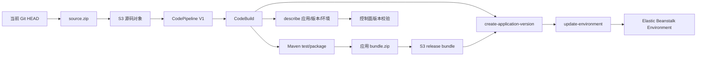

# Elastic Beanstalk 目标

这是一个面向外部 **LocalStack Ultimate/Pro** 的 Elastic Beanstalk + CodePipeline V1 学习目标。它把应用平台交付拆成清晰的三层：应用（Application）、应用版本（Application Version）和环境（Environment）。仓库不会启动、安装、配置、重启或停止 LocalStack；LocalStack 由实验环境在仓库之外提供。

## 1. 先建立整体模型



CodePipeline V1 的 Source Action 从 S3 取源码，Build Action 把源码交给 CodeBuild。CodeBuild 负责 Maven 测试和打包、制作 Beanstalk bundle、上传 release bundle，然后显式调用 `create-application-version` 和 `update-environment`。这里没有使用 CodePipeline V2，也没有假设存在一个可直接使用的原生 Elastic Beanstalk Deploy Action。

## 2. Elastic Beanstalk 的三个对象

| 对象 | 作用 | 本目标如何使用 |
| --- | --- | --- |
| Application | 应用的逻辑容器 | Terraform 创建 `shipstack-beanstalk-application` |
| Application Version | 某一次可部署的 bundle 版本 | CodeBuild 生成 `build-N`，上传到 S3 后创建 |
| Environment | 承载应用版本的托管运行环境 | CodeBuild 检查，不存在时调用 `create-environment`，然后更新版本 |

这和 ECS 的 Service、EKS 的 Deployment、EC2 的 Java 进程不同。Beanstalk 隐藏了更多主机和部署细节，适合学习 PaaS 如何把“应用版本”交给“环境”运行；代价是运行时网络、平台版本和实例细节不如 EC2 直观。

## 3. LocalStack 学习边界

LocalStack 的 Elastic Beanstalk 能力适合验证 Application、Application Version、Environment 以及相关 AWS API 的控制面流程，但不会在本地安装并运行 Beanstalk 应用。因此本目标可以真实验证“版本已经注册、环境指向当前版本”等控制面事实，不能把 LocalStack 中的 Environment 当成一个可访问的应用服务器，也不能伪造 `/health` 或 `/release` 的 HTTP E2E 结果。

官方说明：[LocalStack Elastic Beanstalk 文档](https://docs.localstack.cloud/aws/services/elasticbeanstalk/)；真实 AWS 的环境资源参考：[Terraform AWS provider Elastic Beanstalk environment](https://registry.terraform.io/providers/hashicorp/aws/latest/docs/resources/elastic_beanstalk_environment)。

为了适配这个边界，Terraform 只声明 Beanstalk Application。目标没有声明 `aws_elastic_beanstalk_environment`，因为 LocalStack 已能创建环境，但 Terraform provider 创建资源时会等待 `DescribeEvents`，而当前 LocalStack 实例对该操作返回 `501 Not Implemented`。CodeBuild 先创建 Application Version，再检查环境；首次运行缺少环境时通过 AWS CLI 创建并带上当前 `VersionLabel`，已有环境则调用真实 AWS 等价的 `update-environment`。这个选择保留了 AWS API 学习路径，同时不把 provider waiter 的限制伪装成业务失败。

## 4. 前置条件

- 外部 LocalStack Ultimate/Pro 已经运行，主机 endpoint 默认是 `http://localhost:4566`。
- 使用测试凭证，不要把生产凭证放入命令或文档：

```powershell
$env:AWS_ACCESS_KEY_ID = "test"
$env:AWS_SECRET_ACCESS_KEY = "test"
$env:AWS_DEFAULT_REGION = "us-east-1"
$env:TF_VAR_aws_api_endpoint = "http://localhost:4566"
$env:TF_VAR_codebuild_aws_endpoint = "http://172.17.0.2:4566"
```

主机上的 Terraform/AWS CLI 使用 `localhost`；CodeBuild 容器里的 `localhost` 指向容器自己，所以 `TF_VAR_codebuild_aws_endpoint` 必须改成 CodeBuild 容器能访问的 LocalStack 地址。上面的 `172.17.0.2` 只是当前 Docker bridge 地址，重启或更换环境后必须重新确认，不能盲目照抄。

先确认 LocalStack，不要在本仓库启动它：

```powershell
Invoke-RestMethod http://localhost:4566/_localstack/health | ConvertTo-Json -Depth 5
aws --endpoint-url http://localhost:4566 --region us-east-1 elasticbeanstalk describe-applications
aws --endpoint-url http://localhost:4566 --region us-east-1 elasticbeanstalk describe-environments
```

## 5. 用 Terraform 创建控制面基础设施

直接使用 Terraform CLI：

```powershell
terraform -chdir=targets/beanstalk/infra init
terraform -chdir=targets/beanstalk/infra fmt -check
terraform -chdir=targets/beanstalk/infra validate
terraform -chdir=targets/beanstalk/infra plan
terraform -chdir=targets/beanstalk/infra apply
```

Terraform 会创建 S3 artifact bucket、CloudWatch Logs、CodeBuild project、CodePipeline V1、CodePipeline/CodeBuild IAM role，以及 Beanstalk Application 和环境需要的角色、instance profile。`solution_stack_name` 默认留空，是因为 LocalStack 控制面实验不安装平台；真实 AWS 必须选择 AWS 当前支持的 solution stack 或 platform。

查看输出：

```powershell
$endpoint = "http://localhost:4566"
$region = terraform -chdir=targets/beanstalk/infra output -raw aws_region
$bucket = terraform -chdir=targets/beanstalk/infra output -raw artifact_bucket_name
$application = terraform -chdir=targets/beanstalk/infra output -raw eb_application_name
$environment = terraform -chdir=targets/beanstalk/infra output -raw eb_environment_name
$project = terraform -chdir=targets/beanstalk/infra output -raw codebuild_project_name
$pipeline = terraform -chdir=targets/beanstalk/infra output -raw codepipeline_name

aws --endpoint-url $endpoint --region $region s3api head-bucket --bucket $bucket
aws --endpoint-url $endpoint --region $region elasticbeanstalk describe-applications --application-names $application
aws --endpoint-url $endpoint --region $region codebuild batch-get-projects --names $project
aws --endpoint-url $endpoint --region $region codepipeline get-pipeline --name $pipeline
```

## 6. 上传源码并触发 CodePipeline V1

本目标不新增 PowerShell/bash wrapper。以下是学习时直接执行的两个阶段：先把源码归档上传到 S3，再触发 CodePipeline。上传前确认目标已经在当前 Git `HEAD` 中；如果目标尚未 commit，S3 源码包不会包含它，也就不能宣称是一次 provenance-valid 的流水线验证。

```powershell
$endpoint = "http://localhost:4566"
$region = terraform -chdir=targets/beanstalk/infra output -raw aws_region
$bucket = terraform -chdir=targets/beanstalk/infra output -raw artifact_bucket_name
$key = terraform -chdir=targets/beanstalk/infra output -raw source_object_key
$pipeline = terraform -chdir=targets/beanstalk/infra output -raw codepipeline_name

git archive --format=zip --output=source.zip HEAD
aws --endpoint-url $endpoint --region $region s3 cp source.zip "s3://$bucket/$key"
aws --endpoint-url $endpoint --region $region s3api head-object --bucket $bucket --key $key
aws --endpoint-url $endpoint --region $region codepipeline start-pipeline-execution --name $pipeline
```

观察 V1 的执行状态：

```powershell
aws --endpoint-url $endpoint --region $region codepipeline list-pipeline-executions --pipeline-name $pipeline
aws --endpoint-url $endpoint --region $region codebuild list-builds-for-project --project-name $project
aws --endpoint-url $endpoint --region $region elasticbeanstalk describe-applications --application-names $application
aws --endpoint-url $endpoint --region $region elasticbeanstalk describe-environments --application-name $application --environment-names $environment
```

## 7. Buildspec 的交付顺序

`targets/beanstalk/buildspec.yml` 的关键顺序如下：

1. 检查 Java 21、Maven、AWS CLI 和 zip 工具。
2. 检查外部 LocalStack endpoint、应用名、环境名、S3 bucket 和 IAM 名称等必需变量。
3. 在 `targets/beanstalk/app` 执行 `mvn -B clean test` 和 `mvn -B package -DskipTests`。
4. 把 JAR 和 `Procfile` 放入 bundle，制作 `shipstack-beanstalk-bundle.zip`。
5. 用 `build-N` 作为 release ID，上传 bundle 到 `releases/<release>/`。
6. 用 S3 bundle 创建 Application Version。
7. 查询环境是否存在；首次运行时用带当前版本的 `create-environment` 创建控制面对象，已有环境则用 `update-environment` 更新版本。
8. 用 `describe-applications`、`describe-application-versions`、`describe-environments` 读取最终事实。
9. 用 Python 对 Application、Version、Environment 和当前 release 做严格 JSON 校验。

最后一步输出 `beanstalk-validation.json`。`applicationVersionValidation=PASS` 证明当前 bundle 已注册为 Application Version；`environmentReleaseValidation=PASS` 才证明 Environment 返回当前版本；`UNSUPPORTED_LOCALSTACK` 表示 update API 已调用，但当前 LocalStack 没有保留可验证的 `VersionLabel`。这个状态不是部署成功，也不证明本地有一个可访问的 Beanstalk HTTP server。

## 8. 手工观察 Application Version 和 Environment

```powershell
$application = terraform -chdir=targets/beanstalk/infra output -raw eb_application_name
$environment = terraform -chdir=targets/beanstalk/infra output -raw eb_environment_name

aws --endpoint-url http://localhost:4566 --region us-east-1 elasticbeanstalk describe-application-versions --application-name $application
aws --endpoint-url http://localhost:4566 --region us-east-1 elasticbeanstalk describe-environments --application-name $application --environment-names $environment
```

重点观察：

- Application 中只有预期的应用名。
- Application Version 的 `VersionLabel` 是当前 CodeBuild 生成的 `build-N`。
- Environment 的 `ApplicationName`、`EnvironmentName` 和 `VersionLabel` 互相匹配。
- 不要因为 API 返回 `Ready` 就推断本地应用已经启动；LocalStack 不执行 Beanstalk 平台部署。

## 9. 真实 AWS 的等价路径

在真实 AWS 中，Environment 会选择实际的 platform/solution stack，并由 Elastic Beanstalk 管理 EC2、Auto Scaling、负载均衡、健康状态和应用进程。CodeBuild 仍然可以把 bundle 上传到 S3，调用 `create-application-version`，再调用 `update-environment`；随后应根据真实 Environment 的 CNAME 或负载均衡入口执行 `/health`、`/release` 和当前 release 校验。

真实 AWS 还需要完整且正确的 IAM：CodeBuild 角色要能读写 artifact、调用 Beanstalk API，Beanstalk service role 和 EC2 instance profile 要具备平台运行所需的 AWS 托管权限。当前 Terraform 的角色主要用于学习 API 拓扑，不能直接当成生产权限基线。不要在没有重新检查 endpoint、凭证、region、bucket 和 platform 的情况下把本地变量切到真实 AWS。

## 10. 失败诊断与清理

查看 CodeBuild 日志和 Beanstalk 控制面：

```powershell
$endpoint = "http://localhost:4566"
$region = terraform -chdir=targets/beanstalk/infra output -raw aws_region
$pipeline = terraform -chdir=targets/beanstalk/infra output -raw codepipeline_name
$project = terraform -chdir=targets/beanstalk/infra output -raw codebuild_project_name
$application = terraform -chdir=targets/beanstalk/infra output -raw eb_application_name
$environment = terraform -chdir=targets/beanstalk/infra output -raw eb_environment_name

aws --endpoint-url $endpoint --region $region codepipeline list-pipeline-executions --pipeline-name $pipeline
aws --endpoint-url $endpoint --region $region codebuild list-builds-for-project --project-name $project
aws --endpoint-url $endpoint --region $region elasticbeanstalk describe-environments --application-name $application --environment-names $environment
aws --endpoint-url $endpoint --region $region elasticbeanstalk describe-application-versions --application-name $application
```

如果看到 Terraform 创建环境时 `DescribeEvents` 返回 `501`，这是当前 LocalStack/provider waiter 的能力边界；不要反复 apply 或把失败改写成成功。如果首次创建环境时能保存版本、但后续 `update-environment` 后 `describe-environments` 仍返回旧版本或没有 `VersionLabel`，Buildspec 会把 `environmentReleaseValidation` 标记为 `UNSUPPORTED_LOCALSTACK`，不会把 Application Version 已注册误报成 Environment 已切换。

默认的 `environment_release_validation_mode=localstack-control-plane` 只适用于这个本地学习路径。真实 AWS 必须使用严格模式：

```powershell
$env:TF_VAR_environment_release_validation_mode = "strict"
terraform -chdir=targets/beanstalk/infra plan
terraform -chdir=targets/beanstalk/infra apply
```

在 `strict` 模式下，Environment 的 `VersionLabel` 不等于当前 release 会让 CodeBuild 非零退出。

不再学习该目标时，先处理可能由 CodeBuild 创建的环境，再删除应用和 Terraform 资源。下面命令具有删除效果，执行前确认 endpoint 和名称：

```powershell
$endpoint = "http://localhost:4566"
$region = "us-east-1"
$application = terraform -chdir=targets/beanstalk/infra output -raw eb_application_name
$environment = terraform -chdir=targets/beanstalk/infra output -raw eb_environment_name

aws --endpoint-url $endpoint --region $region elasticbeanstalk terminate-environment --application-name $application --environment-name $environment
aws --endpoint-url $endpoint --region $region elasticbeanstalk delete-application --application-name $application --terminate-env-by-force
terraform -chdir=targets/beanstalk/infra destroy
```

最后一条 Terraform 命令只清理 Terraform 管理的资源；它不会删除仓库外的 LocalStack。若环境不存在，先跳过对应 AWS 删除命令，不要对其他环境执行清理。

## 11. 学习结论

这个目标最适合回答一个问题：当部署对象从“容器/主机/Pod/函数”变成“托管应用平台”时，CI/CD 仍然如何用一个可追踪的 release，把 S3 中的 bundle 注册成 Application Version，再让 Environment 指向它。LocalStack 可以帮助学习 API、Terraform、CodePipeline V1 和 CodeBuild 的控制面关系；真实 AWS 才能证明 Beanstalk 平台实际安装、启动和暴露应用。
