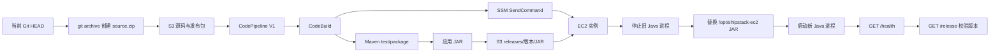

# EC2 目标

这是 Shipstack 的 EC2 主机交付学习目标。它使用已经在仓库外运行的 **LocalStack Ultimate**，模拟传统的 CodePipeline V1 → CodeBuild → SSM → EC2 流程。

本仓库不会创建、启动、安装、配置或管理 LocalStack，也不会保存 `LOCALSTACK_AUTH_TOKEN`。LocalStack 是本实验的外部依赖。

## 1. 先理解整体架构



核心链路是：

```text
Source -> Build/Test -> Package -> Deliver artifact -> Deploy to machine -> Restart -> Validate
```

这里没有 CodePipeline 的 EC2 Deploy provider。CodePipeline 只负责 S3 Source 和 CodeBuild；主机部署逻辑明确写在 `buildspec.yml` 的 AWS CLI/SSM 命令中。

## 2. EC2 与 ECS 的区别

ECS 目标主要让平台负责容器调度、任务重启、端口映射、健康检查和日志接入。EC2 目标把这些步骤拆开，让你直接看到：

- 主机、操作系统和文件系统；
- JAR 放在哪里；
- 哪个 Java 进程在运行；
- 进程号、停止和启动；
- 8080 端口是否监听；
- SSM 命令是否完成；
- HTTP 健康检查和 release 校验是否通过。

ECS 交付的主要对象是容器镜像；EC2 交付的主要对象是 JAR 文件。Terraform 只负责提供基础设施，CodeBuild 才负责把新版本部署到机器。

## 3. 应用接口

`targets/ec2/app/` 是一个 Java 21 Spring Boot 应用：

- `GET /health` 返回 `{"status":"UP"}`；
- `GET /release` 返回 `service`、`target` 和 `release`；
- `APP_VERSION` 环境变量作为发布版本；
- 没有设置 `APP_VERSION` 时，版本回退为 `dev`。

应用测试位于 `app/src/test/`，测试接口行为而不是测试 AWS 服务。

## 4. Endpoint 边界

Terraform 和不同运行环境访问 LocalStack 的网络路径可能不同，因此 Terraform 有三个输入：

- `aws_api_endpoint`：运行 Terraform 的主机访问的 endpoint，默认 `http://localhost:4566`；
- `codebuild_aws_endpoint`：CodeBuild 容器访问的 endpoint，例如 `http://172.17.0.2:4566`；
- `instance_aws_endpoint`：CodeBuild 生成 presigned URL 时使用的 EC2 可达 endpoint，例如 `http://localstack:4566`。

这三个值不是三个 LocalStack 实例。它们只是同一个外部 LocalStack 服务在不同网络命名空间中的可达地址。

## 5. 创建 Terraform 基础设施

先确认外部 LocalStack 已运行，然后直接执行：

```powershell
$env:AWS_ACCESS_KEY_ID = "test"
$env:AWS_SECRET_ACCESS_KEY = "test"
$env:AWS_DEFAULT_REGION = "us-east-1"
$env:TF_VAR_aws_api_endpoint = "http://localhost:4566"
$env:TF_VAR_codebuild_aws_endpoint = "http://172.17.0.2:4566"
$env:TF_VAR_instance_aws_endpoint = "http://172.17.0.2:4566"

terraform -chdir=targets/ec2/infra init
terraform -chdir=targets/ec2/infra fmt -check -recursive
terraform -chdir=targets/ec2/infra validate
terraform -chdir=targets/ec2/infra plan
terraform -chdir=targets/ec2/infra apply
```

默认 AMI `ami-024f768332f0` 是当前 LocalStack 提供的 Docker-backed Amazon Linux 2023 教学镜像。实例设计为通过 user data 和 SSM 命令安装 Java 21 与 curl；当前环境中实例访问 LocalStack 使用 `http://172.17.0.2:4566`，该地址会随 Docker 网络变化，应按实际 endpoint 替换。真实 AWS 必须替换成目标 Region 中真实存在的 AMI，并确保该 AMI 安装了 SSM Agent、Java 21 和 curl，或调整 bootstrap 命令。

## 6. 打包并上传源码

CodePipeline 的 Source action 读取 S3 的 `source.zip`。脚本只使用当前 Git `HEAD`，不会把未提交的工作树伪装成已发布源码：

```powershell
.\targets\ec2\build.ps1 -Stage Upload -LocalStackEndpoint http://localhost:4566
```

该阶段做三件事：

1. 检查 `HEAD` 确实包含 `targets/ec2/`；
2. 使用 `git archive --format=zip HEAD` 创建临时归档；
3. 用 AWS CLI 上传到 LocalStack S3 并执行 `head-object` 校验。

因此，在目标尚未 commit 时，Upload 会明确失败。这是源码 provenance 保护，不是成功上传。

## 7. 触发流水线

```powershell
.\targets\ec2\build.ps1 -Stage Pipeline -LocalStackEndpoint http://localhost:4566
```

CodeBuild 会依次执行：

1. `mvn -B clean test`；
2. `mvn -B package -DskipTests`；
3. 将 JAR 上传到 `s3://<bucket>/releases/<release>/shipstack-ec2-app.jar`；
4. 生成只对本次发布有效的 S3 presigned URL，并用 `ssm send-command` 调用 `AWS-RunShellScript`；
5. 轮询 `ssm get-command-invocation` 直到命令结束；
6. 从 SSM 输出检查进程、`/health` 和 `/release`；
7. 将 release、SSM command ID、SSM 响应作为 CodeBuild artifact 输出。

任何 Maven、S3、SSM、进程、HTTP 或 release 检查失败都会使 CodeBuild 以失败状态结束。

## 8. 手工检查资源

```powershell
$endpoint = "http://localhost:4566"
$region = "us-east-1"
$instanceId = terraform -chdir=targets/ec2/infra output -raw ec2_instance_id
$pipeline = terraform -chdir=targets/ec2/infra output -raw codepipeline_name

aws --endpoint-url $endpoint --region $region ec2 describe-instances --instance-ids $instanceId
aws --endpoint-url $endpoint --region $region ssm describe-instance-information
aws --endpoint-url $endpoint --region $region codepipeline get-pipeline --name $pipeline
aws --endpoint-url $endpoint --region $region codepipeline list-action-executions --pipeline-name $pipeline
aws --endpoint-url $endpoint --region $region codebuild list-builds-for-project --project-name shipstack-ec2-build
```

查看最新 SSM 命令：

```powershell
aws --endpoint-url $endpoint --region $region ssm list-commands --instance-id $instanceId
aws --endpoint-url $endpoint --region $region ssm get-command-invocation --command-id <command-id> --instance-id $instanceId
```

如果 LocalStack 的 EC2/SSM 实现返回了实例或命令控制面对象，但没有真实的可执行操作系统，应将结果标记为 control-plane PASS、runtime validation BLOCKED，不能把 SSM 命令已接受当成应用部署成功。

## 9. 进程和端口学习重点

远程命令的生命周期是：

```text
old Java process
  -> kill old PID
  -> download new JAR from S3
  -> replace /opt/shipstack-ec2/shipstack-ec2-app.jar
  -> start APP_VERSION=<release> java -jar
  -> kill -0 check
  -> curl /health
  -> curl /release
```

演示使用 PID 文件和 `nohup`，便于观察；真实生产环境通常会使用 systemd、专用 Unix 用户、原子文件切换、回滚、超时、日志轮转和更严格的权限。

## 10. 日志与故障排查

应用日志写入实例上的 `/opt/shipstack-ec2/shipstack-ec2-app.log`。CodeBuild 日志组由 Terraform 创建为 `/aws/codebuild/shipstack-ec2-build`。SSM 的标准输出和错误输出通过 `get-command-invocation` 查询。

常见问题：

- `Upload` 报告 HEAD 不包含目标：先 commit 当前目标，或在实验中明确生成包含当前工作树的临时源码包；不要把空归档当成成功；
- CodeBuild 无法访问 endpoint：检查 `codebuild_aws_endpoint`；
- SSM 找不到实例：检查 EC2 是否已注册到 SSM，以及 LocalStack 是否实现了对应运行时；
- JAR 下载失败：检查 presigned URL、实例网络、bucket/key 和实例上的 curl；
- `/health` 失败：检查 Java、PID、8080 端口和实例日志；
- `/release` 不是本次版本：检查 `APP_VERSION`、release 路径和旧进程是否真正停止。

## 11. LocalStack 与真实 AWS 的边界

LocalStack Ultimate 适合观察 AWS API、资源关系、Pipeline/Build/SSM 控制面和可支持的运行时行为，但不能自动等同于真实 EC2：

- LocalStack 的 EC2 运行时能力取决于版本、授权和启动配置；
- Terraform 创建 `aws_instance` 不代表一定有可登录、可运行 Java 的真实操作系统；
- SSM `send-command` 成功不代表远程进程一定启动；
- 真实 AWS 需要真实 AMI、VPC 路由、实例角色、SSM Agent、网络出口和安全组；
- 真实部署还应增加 systemd、回滚、蓝绿/滚动发布、秘密管理、补丁管理和监控。

因此本目标会分别报告 Terraform/control-plane 结果和 EC2 application runtime 结果，不会用 localhost Java 进程替代 EC2。

## 12. 清理

确认不再需要实验资源后执行：

```powershell
terraform -chdir=targets/ec2/infra destroy
```

这只删除本目标通过 Terraform 创建的 LocalStack 资源，不会停止或删除外部 LocalStack 实例。
