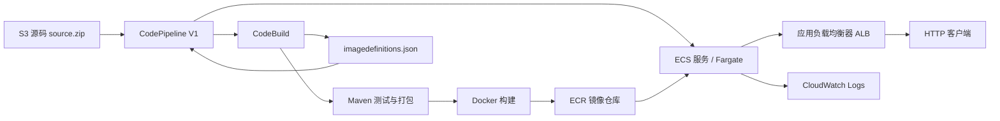

# ECS 目标

该目标是一个面向 **LocalStack Ultimate** 的最小 ECS CI/CD 学习实现。

## 学习内容

- 使用 Terraform 创建 VPC、ALB、IAM、ECR、ECS、CloudWatch Logs、CodeBuild、CodePipeline 和 S3。
- 理解 CodePipeline 的源码 -> 构建 -> ECS 部署流程。
- 理解 Maven 测试/打包 -> Docker 构建 -> 推送 ECR 的流程。
- 理解 ECS/Fargate 网络配置和 ALB 健康检查。
- 理解容器标准输出进入 CloudWatch Logs 的过程。



## 前置条件

- LocalStack Ultimate 已经在本仓库之外启动。
- Terraform、AWS CLI、Docker、Java 21 和 Maven 可用。
- Shell 中配置了测试用 AWS 凭证，例如 `AWS_ACCESS_KEY_ID=test` 和 `AWS_SECRET_ACCESS_KEY=test`。

本仓库不会启动 LocalStack，也不会保存 `LOCALSTACK_AUTH_TOKEN`。仓库只提供一个带两个阶段的 PowerShell 命令，用于重复执行本地流水线学习流程；它不会管理 LocalStack 的生命周期。

## LocalStack endpoint 配置

Terraform 使用两个明确的 endpoint 输入，因为运行 Terraform 的主机和 CodeBuild 容器可能通过不同的网络地址访问 LocalStack：

- `TF_VAR_aws_api_endpoint`：运行 Terraform 的主机可以访问的 LocalStack endpoint。
- `TF_VAR_codebuild_aws_endpoint`：CodeBuild 容器可以访问的 LocalStack endpoint。

只有当 LocalStack 暴露的 ECR 端口与模拟 ECR API 返回的仓库 URI 不同时，才需要设置 `TF_VAR_ecr_registry_port`。

主机端配置示例：

```bash
export AWS_ACCESS_KEY_ID=test
export AWS_SECRET_ACCESS_KEY=test
export AWS_DEFAULT_REGION=us-east-1
export TF_VAR_aws_api_endpoint=http://localhost:4566
export TF_VAR_codebuild_aws_endpoint=http://localstack:4566
```

请根据你的 LocalStack Docker/network 配置，填写 CodeBuild 容器可以访问的 endpoint；它不一定要与主机 endpoint 相同。

## 创建基础设施

直接运行 Terraform：

```bash
terraform -chdir=targets/ecs/infra init
terraform -chdir=targets/ecs/infra fmt -check
terraform -chdir=targets/ecs/infra validate
terraform -chdir=targets/ecs/infra plan
terraform -chdir=targets/ecs/infra apply
```

`.terraform.lock.hcl` 不在忽略列表中。请提交 `terraform init` 生成的锁定文件，以保证 Provider 选择具有可重复性。

## 运行流水线

CodePipeline 使用 S3 中的 `source.zip` 对象作为源码 Action，因此这个 LocalStack 实验不需要 GitHub OAuth 或 CodeConnections。

使用原生 Git 命令创建源码归档：

```bash
git archive --format=zip --output=source.zip HEAD
```

使用原生 CLI 上传源码并启动流水线（如果 LocalStack 端口不同，请替换 endpoint）：

```bash
export LOCALSTACK_ENDPOINT="$TF_VAR_aws_api_endpoint"
export ARTIFACT_BUCKET="$(terraform -chdir=targets/ecs/infra output -raw artifact_bucket_name)"
export PIPELINE_NAME="$(terraform -chdir=targets/ecs/infra output -raw codepipeline_name)"
aws --endpoint-url "$LOCALSTACK_ENDPOINT" s3 cp source.zip "s3://$ARTIFACT_BUCKET/source.zip"
aws --endpoint-url "$LOCALSTACK_ENDPOINT" codepipeline start-pipeline-execution --name "$PIPELINE_NAME"
```

### 双阶段 PowerShell 流程

在 Windows 上，可以按顺序运行同一个命令的两个阶段。该命令接受 LocalStack endpoint，并将它以及 Terraform 管理的区域传给每一次 AWS CLI 调用。

第一阶段从当前 Git `HEAD` 创建源码归档，上传到 Terraform 管理的 S3 源码位置，并校验对象：

```powershell
.\targets\ecs\build.ps1 -Stage Upload -LocalStackEndpoint http://localhost:4566
```

第二阶段启动 Terraform 管理的 CodePipeline，并等待最终状态。随后 CodePipeline 会从 S3 下载 `source.zip`，执行 Build 和 Deploy 阶段：

```powershell
.\targets\ecs\build.ps1 -Stage Pipeline -LocalStackEndpoint http://localhost:4566
```

该脚本不会运行 `terraform apply`，不会启动或停止 LocalStack，也不会调用真实 AWS endpoint。若希望逐条观察 API 操作，请使用上面的原生 CLI 命令。脚本相对于 `targets/ecs/` 目录自包含；其他项目组复制它和对应的 `infra` 目录后，资源名称会从 Terraform 输出读取，而不是硬编码仓库名称。

CodeBuild 的构建编号会成为镜像标签（`build-N`）。当仿真环境不提供 `CODEBUILD_BUILD_NUMBER` 时，才会使用时间戳作为备用值。构建只输出 ECS 标准 Deploy Action 所需的 `imagedefinitions.json`。

## 检查结果

有用的 Terraform 输出包括：

```bash
terraform -chdir=targets/ecs/infra output
```

随后可以使用 AWS CLI 或 HTTP 命令直接检查 ECS、ECR、CodePipeline、CloudWatch Logs 或 ALB endpoint。保留这些命令的显式形式，是为了方便学习每一步，而不是把仓库做成一个编排框架。
