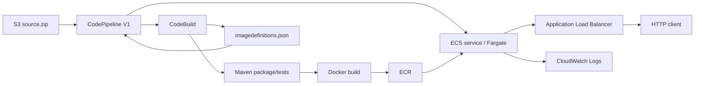

# ECS target

This target is a minimal ECS CI/CD learning implementation for **LocalStack Ultimate**.

## What it teaches

- Terraform provisioning of VPC, ALB, IAM, ECR, ECS, CloudWatch Logs, CodeBuild, CodePipeline, and S3.
- CodePipeline source -> build -> ECS deploy flow.
- Maven test/package -> Docker build -> ECR push.
- ECS/Fargate networking and ALB health checks.
- Container stdout -> CloudWatch Logs.



## Prerequisites

- LocalStack Ultimate is already running outside this repository.
- Terraform, AWS CLI, Docker, Java 21, and Maven are available.
- The shell has test AWS credentials, for example `AWS_ACCESS_KEY_ID=test` and `AWS_SECRET_ACCESS_KEY=test`.

The repository does not start LocalStack, store `LOCALSTACK_AUTH_TOKEN`, or provide `.sh`, `.ps1`, Makefile, or other orchestration wrappers.

## LocalStack endpoints

Terraform uses two explicit endpoint inputs because the host and the CodeBuild container can see LocalStack through different network addresses:

- `TF_VAR_aws_api_endpoint`: LocalStack endpoint reachable from the host running Terraform.
- `TF_VAR_codebuild_aws_endpoint`: LocalStack endpoint reachable from the CodeBuild container.

`TF_VAR_ecr_registry_port` is only needed when LocalStack exposes ECR on a host port different from the registry URI returned by the emulated ECR API.

Example host setup:

```bash
export AWS_ACCESS_KEY_ID=test
export AWS_SECRET_ACCESS_KEY=test
export AWS_DEFAULT_REGION=us-east-1
export TF_VAR_aws_api_endpoint=http://localhost:4566
export TF_VAR_codebuild_aws_endpoint=http://localstack:4566
```

Use the CodeBuild-reachable endpoint that matches your LocalStack Docker/network setup; it does not have to equal the host endpoint.

## Provision

Run Terraform directly:

```bash
terraform -chdir=targets/ecs/infra init
terraform -chdir=targets/ecs/infra fmt -check
terraform -chdir=targets/ecs/infra validate
terraform -chdir=targets/ecs/infra plan
terraform -chdir=targets/ecs/infra apply
```

`.terraform.lock.hcl` is intentionally not ignored. Commit the lock file generated by `terraform init` so provider selection stays reproducible.

## Run the pipeline

CodePipeline uses an S3 `source.zip` object as the source action so the LocalStack lab does not require GitHub OAuth/CodeConnections.

Create the source artifact with a native Git command:

```bash
git archive --format=zip --output=source.zip HEAD
```

Upload the source and start the pipeline with native CLI commands (replace the endpoint if your LocalStack port differs):

```bash
export LOCALSTACK_ENDPOINT="$TF_VAR_aws_api_endpoint"
export ARTIFACT_BUCKET="$(terraform -chdir=targets/ecs/infra output -raw artifact_bucket_name)"
export PIPELINE_NAME="$(terraform -chdir=targets/ecs/infra output -raw codepipeline_name)"
aws --endpoint-url "$LOCALSTACK_ENDPOINT" s3 cp source.zip "s3://$ARTIFACT_BUCKET/source.zip"
aws --endpoint-url "$LOCALSTACK_ENDPOINT" codepipeline start-pipeline-execution --name "$PIPELINE_NAME"
```

The CodeBuild build number becomes the image tag (`build-N`). A timestamp is used only as a fallback when an emulator does not expose `CODEBUILD_BUILD_NUMBER`. The build emits only the artifact that the ECS standard deploy action consumes: `imagedefinitions.json`.

## Inspect the result

Useful Terraform outputs include:

```bash
terraform -chdir=targets/ecs/infra output
```

From there, inspect ECS, ECR, CodePipeline, CloudWatch Logs, or the ALB endpoint directly with AWS CLI / HTTP commands. Keeping those commands explicit is intentional: this repository is a learning lab, not an orchestration framework.
