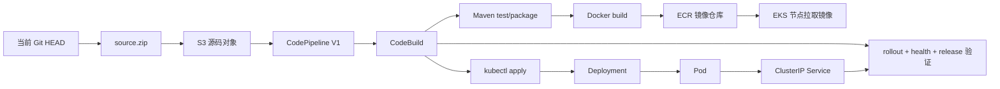

# EKS 目标

这是一个面向外部 **LocalStack Ultimate/Pro** 的 EKS + CodePipeline V1 学习目标。它保留 AWS 服务的职责边界，但部署动作由 CodeBuild 中显式执行的 `kubectl` 完成；仓库不会启动、安装、配置或停止 LocalStack，也不包含 LocalStack Compose 文件。

## 1. 先建立整体模型



这条链路中，CodePipeline V1 只负责把 S3 源码 Action 的输出交给 CodeBuild。Buildspec 再完成测试、镜像构建、ECR 推送、kubeconfig、`kubectl apply`、rollout 和运行时验证。因此这里没有使用 CodePipeline V2 的原生 EKSDeploy Action，也没有把 Kubernetes 部署隐藏在 Terraform 中。

## 2. ECS 与 EKS 的核心区别

| 学习对象 | ECS 目标 | EKS 目标 |
| --- | --- | --- |
| 镜像位置 | ECR | ECR |
| 调度对象 | ECS Task | Kubernetes Pod |
| 期望状态 | ECS Service | Kubernetes Deployment |
| 服务发现/暴露 | ALB + Target Group | Kubernetes Service；本实验用 `kubectl port-forward` 验证 |
| 部署动作 | CodePipeline ECS Deploy Action | CodeBuild 中的 `kubectl apply` |
| 滚动发布 | ECS Service deployment | `kubectl rollout status deployment/shipstack-eks` |

Pod 是实际运行一个或多个容器的最小调度单元；Deployment 维护 Pod 副本数和滚动更新；Service 为匹配标签的 Pod 提供稳定的访问入口。本目标的 Service 是 `ClusterIP`，所以 CodeBuild 通过短暂的 `kubectl port-forward` 访问它；这一步同时证明了 Pod、Service 和应用 HTTP 接口连通。

## 3. LocalStack EKS 的边界

LocalStack 的 EKS API 可以创建由本地 Docker 中嵌入式 k3d/k3s 支撑的集群。创建控制面后还必须创建 managed node group，否则控制面节点不可用于调度业务 Pod。这个目标的 Terraform 同时声明 `aws_eks_cluster` 和 `aws_eks_node_group`，但是否能够创建嵌入式集群仍取决于你外部运行的 LocalStack 版本、授权、Docker 后端和其 EKS 配置。

LocalStack EKS 不是 AWS 托管的真实 EKS。LocalStack 文档把该能力标为本地 EKS 模拟；实验得到的 `kubectl` endpoint、k3d/k3s 容器、ECR DNS 和 CodeBuild 网络地址都必须在当前环境中验证，不能直接当作生产网络设计。

如果 `aws eks list-clusters` 可以访问但创建失败，优先检查外部 LocalStack 日志、授权和 Docker 后端；不要在本仓库中再启动第二个 LocalStack。若创建成功，先等待 cluster 和 node group 都达到 `ACTIVE`，再运行流水线。

## 4. 前置条件

- 外部 LocalStack Ultimate/Pro 已经运行，主机 endpoint 默认是 `http://localhost:4566`。
- 已配置测试凭证，不要使用生产凭证：

```powershell
$env:AWS_ACCESS_KEY_ID = "test"
$env:AWS_SECRET_ACCESS_KEY = "test"
$env:AWS_DEFAULT_REGION = "us-east-1"
$env:TF_VAR_aws_api_endpoint = "http://localhost:4566"
$env:TF_VAR_codebuild_aws_endpoint = "http://172.17.0.2:4566"
$env:TF_VAR_codebuild_kubernetes_api_endpoint = "https://172.17.0.2:4511"
```

`TF_VAR_codebuild_aws_endpoint` 是 CodeBuild 容器访问 LocalStack 的地址，不一定等于主机的 `localhost`。如果你的 CodeBuild 容器使用 Docker bridge 地址，应把它改成该容器真实可达的 endpoint。ECR 返回的 registry URI 也必须能被 Docker build/CodeBuild 和 EKS 节点解析；必要时设置 `TF_VAR_ecr_registry_port`。

`TF_VAR_codebuild_kubernetes_api_endpoint` 是 CodeBuild 容器访问 Kubernetes API 的地址。`aws eks update-kubeconfig` 返回的 `localhost.localstack.cloud:4511` 面向主机，不一定能在 CodeBuild 容器内访问；因此这里使用 LocalStack 容器的 Docker bridge 地址。Buildspec 会把 kubeconfig 的 server 改为这个地址，并仅对本地模拟 API 关闭证书主机名校验。

确认 LocalStack，不要启动它：

```powershell
Invoke-RestMethod http://localhost:4566/_localstack/health | ConvertTo-Json -Depth 5
aws --endpoint-url http://localhost:4566 --region us-east-1 eks list-clusters
```

## 5. Terraform 创建 AWS 资源

Terraform 在 `targets/eks/infra/` 中声明 VPC、公有子网、ECR、EKS cluster、managed node group、IAM、CloudWatch Logs、S3、CodeBuild 和 CodePipeline V1。直接使用 Terraform CLI：

```powershell
terraform -chdir=targets/eks/infra init
terraform -chdir=targets/eks/infra fmt -check
terraform -chdir=targets/eks/infra validate
terraform -chdir=targets/eks/infra plan
terraform -chdir=targets/eks/infra apply
```

观察 EKS 的状态：

```powershell
$endpoint = "http://localhost:4566"
$region = terraform -chdir=targets/eks/infra output -raw aws_region
$cluster = terraform -chdir=targets/eks/infra output -raw eks_cluster_name
$nodes = terraform -chdir=targets/eks/infra output -raw eks_node_group_name
aws --endpoint-url $endpoint --region $region eks describe-cluster --name $cluster
aws --endpoint-url $endpoint --region $region eks describe-nodegroup --cluster-name $cluster --nodegroup-name $nodes
```

不要在流水线运行前假定 cluster 已经可用；检查 `status` 是否为 `ACTIVE`。LocalStack 的嵌入式 Kubernetes 还会在 Docker 中出现相应的 k3d/k3s 运行容器。

## 6. 两阶段的源码上传与流水线触发

本目标不新增 PowerShell/bash wrapper。按学习顺序直接执行 Git、Terraform 和 AWS CLI 命令。源码 Action 读取 S3 的 `source.zip`，不是 GitHub OAuth 或 GitHub Actions：

```powershell
$endpoint = "http://localhost:4566"
$region = terraform -chdir=targets/eks/infra output -raw aws_region
$bucket = terraform -chdir=targets/eks/infra output -raw artifact_bucket_name
$key = terraform -chdir=targets/eks/infra output -raw source_object_key
$pipeline = terraform -chdir=targets/eks/infra output -raw codepipeline_name

git archive --format=zip --output=source.zip HEAD
aws --endpoint-url $endpoint --region $region s3 cp source.zip "s3://$bucket/$key"
aws --endpoint-url $endpoint --region $region s3api head-object --bucket $bucket --key $key
aws --endpoint-url $endpoint --region $region codepipeline start-pipeline-execution --name $pipeline
```

上传前确认需要进入流水线的文件已经存在于当前 Git `HEAD`。CodePipeline V1 会从 S3 下载该归档，再执行 `targets/eks/buildspec.yml`。

## 7. Buildspec 是如何完成部署的

Buildspec 的关键顺序如下：

1. 使用 CodeBuild 的 Java 21、Maven、Docker、AWS CLI 和 kubectl。
2. 用 `build-N` 作为镜像标签和当前 release ID。
3. 执行 `mvn -B clean package`，构建 Java 21 应用。
4. 使用 Docker 构建镜像并推送到 Terraform 输出的 ECR URI。
5. 将 Kubernetes 模板中的 namespace、镜像 URI、release ID 以内联 `sed` 渲染到构建目录。
6. 用 `aws eks update-kubeconfig` 获取当前 LocalStack EKS 集群上下文。
7. 执行 `kubectl apply`，然后等待 Deployment rollout 完成。
8. 列出 Deployment、Pod 和 Service，启动短暂的 `kubectl port-forward`。
9. 检查 `/health` 返回 JSON 中的 `status=UP`，再检查 `/release` 的 `service=shipstack`、`target=eks` 和 `release=当前 build-N`。

健康检查是 Kubernetes readiness probe 和流水线最终 HTTP 验证的两层保护；release 校验用于防止“旧 Pod 仍然可访问”被误判为新版本部署成功。

## 8. 手工使用 kubectl 学习

如果已经在主机上为集群建立了 kubeconfig，可以把 context 切换到 Terraform 输出的集群，然后观察资源：

```powershell
$cluster = terraform -chdir=targets/eks/infra output -raw eks_cluster_name
aws --endpoint-url http://localhost:4566 --region us-east-1 eks update-kubeconfig --name $cluster
kubectl config current-context
kubectl get nodes
kubectl get all --namespace shipstack-eks
kubectl describe deployment shipstack-eks --namespace shipstack-eks
kubectl describe pod --namespace shipstack-eks --selector app.kubernetes.io/name=shipstack-eks
kubectl logs --namespace shipstack-eks --selector app.kubernetes.io/name=shipstack-eks --all-containers --tail=100
kubectl port-forward --namespace shipstack-eks service/shipstack-eks 18080:8080
```

另开一个终端访问：

```powershell
Invoke-RestMethod http://127.0.0.1:18080/health
Invoke-RestMethod http://127.0.0.1:18080/release
```

## 9. 日志、失败诊断与清理

CodeBuild 日志组名称可以从 Terraform 输出取得；失败时先查看 CodePipeline、CodeBuild、EKS 状态、Pod 事件和 Pod 日志：

```powershell
$endpoint = "http://localhost:4566"
$region = terraform -chdir=targets/eks/infra output -raw aws_region
$pipeline = terraform -chdir=targets/eks/infra output -raw codepipeline_name
$project = terraform -chdir=targets/eks/infra output -raw codebuild_project_name
$cluster = terraform -chdir=targets/eks/infra output -raw eks_cluster_name
$nodegroup = terraform -chdir=targets/eks/infra output -raw eks_node_group_name

aws --endpoint-url $endpoint --region $region codepipeline list-pipeline-executions --pipeline-name $pipeline
aws --endpoint-url $endpoint --region $region codebuild list-builds-for-project --project-name $project
aws --endpoint-url $endpoint --region $region eks describe-cluster --name $cluster
aws --endpoint-url $endpoint --region $region eks describe-nodegroup --cluster-name $cluster --nodegroup-name $nodegroup
kubectl get events --namespace shipstack-eks --sort-by=.lastTimestamp
```

确认不再学习该目标后，才执行 Terraform 清理：

```powershell
terraform -chdir=targets/eks/infra destroy
```

这会删除该目标 Terraform 管理的资源；它不会删除或停止仓库之外的 LocalStack。

## 10. LocalStack 与真实 AWS 的差异

- LocalStack endpoint、测试凭证、嵌入式 k3d/k3s 和 Docker-backed ECR 只用于本地学习。
- 真实 AWS 需要真实 EKS control plane、真实节点或 Fargate、VPC 路由、IAM、ECR 网络访问和 Kubernetes 身份认证配置。
- 真实 EKS 的 CodeBuild 容器必须能够访问 Kubernetes API endpoint；不能把 `localhost` 当成通用地址。
- 真实环境可以让 CodePipeline 使用专门的 Kubernetes/EKS 部署集成，但本目标刻意展示 V1 + CodeBuild + kubectl 的显式路径。
- LocalStack 文档注明 EKS/eksctl 支持仍可能受版本和环境影响；本地 E2E 必须以当前运行实例实际输出为准。
