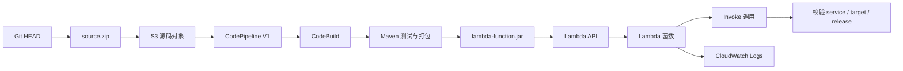

# Lambda 目标

这是一个面向 **LocalStack Ultimate** 的最小 Java 21 Lambda CI/CD 学习目标。它复用 ECS 目标的传统源码交付方式，但把最后的部署对象从 ECS 容器镜像改成 Lambda 部署包。

## 学习目标

本目标完整展示下面这条交付生命周期：

```text
源码
  ->
构建与测试
  ->
打包 Lambda 部署包
  ->
通过 Lambda API 部署
  ->
调用并校验实际运行版本
```

对应的 AWS 服务链路是：



## 与 ECS 目标的区别

两个目标都使用 `source.zip -> S3 -> CodePipeline V1 -> CodeBuild`，但交付对象不同：

| 对比项 | ECS 目标 | Lambda 目标 |
| --- | --- | --- |
| 构建结果 | Docker 镜像 | Java Lambda 部署包 `lambda-function.jar` |
| 发布位置 | ECR | Lambda 函数代码 |
| 部署动作 | ECS Deploy Action 使用 `imagedefinitions.json` | CodeBuild 使用 `aws lambda update-function-code` |
| 运行验证 | 通过 ALB HTTP 请求检查容器 | 通过 `aws lambda invoke` 检查函数响应 |
| 运行环境 | ECS/Fargate 容器 | Lambda Java 21 运行时 |

这里的 `lambda-function.jar` 是应用部署包，不是 ECS 镜像。应用返回当前 `APP_VERSION`，因此可以直接证明哪一次发布正在运行：

```json
{
  "service": "shipstack",
  "target": "lambda",
  "release": "build-123"
}
```

## 为什么使用 CodePipeline V1

本目标刻意使用 CodePipeline V1，目的是先学习传统且显式的交付模型：

```text
S3 源码
  -> CodePipeline V1 Source
  -> CodePipeline V1 Build
  -> CodeBuild
  -> Lambda API
```

CodePipeline V1 没有被假设存在的原生 Lambda Deploy Action。本目标不会伪造一个 V1 Lambda 部署 Action，也不使用 CodePipeline V2 或 V2 Lambda Deploy Action。CodeBuild 直接调用 Lambda API，能清楚展示“构建完成后，哪个 AWS API 修改了函数代码”。

以后学习 CodePipeline V2 时，可以把它作为另一个实验进行比较；当前目标保持 V1，是为了让传统的 Source、Build 和显式 API 部署边界足够清晰。

## 前置条件

- LocalStack Ultimate 已经在本仓库之外启动。
- Terraform、AWS CLI、Java 21、Maven 和 Git 可用。
- 需要一个能够运行 Lambda Java 21 的 LocalStack Ultimate 环境。
- Shell 中配置测试用 AWS 凭证，例如 `AWS_ACCESS_KEY_ID=test` 和 `AWS_SECRET_ACCESS_KEY=test`。
- CodeBuild 需要能够在其运行环境中访问同一个 LocalStack；主机 endpoint 和 CodeBuild endpoint 可能不同。

本仓库不会启动、安装、配置或停止 LocalStack，也不会保存 `LOCALSTACK_AUTH_TOKEN`。本目标的脚本只连接到你已经启动的外部 LocalStack endpoint。

## LocalStack endpoint 配置

Terraform 在主机上运行，CodeBuild 在另一个运行环境中运行，因此使用两个 endpoint 变量：

- `TF_VAR_aws_api_endpoint`：Terraform 主机访问 LocalStack 的 endpoint。
- `TF_VAR_codebuild_aws_endpoint`：CodeBuild 容器访问 LocalStack 的 endpoint。

这个目标将两个变量都作为明确的 LocalStack 地址使用，不为 CodeBuild 提供真实 AWS 的静默回退。主机配置示例：

```bash
export AWS_ACCESS_KEY_ID=test
export AWS_SECRET_ACCESS_KEY=test
export AWS_DEFAULT_REGION=us-east-1
export TF_VAR_aws_api_endpoint=http://localhost:4566
export TF_VAR_codebuild_aws_endpoint=http://localstack:4566
```

如果你的 CodeBuild 容器通过其他地址访问 LocalStack，请替换 `TF_VAR_codebuild_aws_endpoint`。在 Windows PowerShell 中也可以直接设置：

```powershell
$env:AWS_ACCESS_KEY_ID = "test"
$env:AWS_SECRET_ACCESS_KEY = "test"
$env:AWS_DEFAULT_REGION = "us-east-1"
$env:TF_VAR_aws_api_endpoint = "http://localhost:4566"
$env:TF_VAR_codebuild_aws_endpoint = "http://localstack:4566"
```

## 第一次准备：构建 Terraform 的引导部署包

Terraform 创建 Lambda 函数时需要一个初始 Java 部署包。这个初始包只用于让 Lambda 函数先存在；之后的正式发布由 CodeBuild 重新构建并通过 Lambda API 更新。

先直接运行 Maven：

```powershell
Push-Location targets/lambda/app
mvn -B clean package
Pop-Location
```

成功后应生成：

```text
targets/lambda/app/target/lambda-function.jar
```

该 JAR 是包含 Lambda Core 依赖的可部署 Java 包。`target/` 已被 Git 忽略，不需要提交构建产物。

## 使用 Terraform 创建基础设施

直接运行 Terraform，不要让脚本代替 Terraform 管理基础设施：

```powershell
terraform -chdir=targets/lambda/infra init
terraform -chdir=targets/lambda/infra fmt -check
terraform -chdir=targets/lambda/infra validate
terraform -chdir=targets/lambda/infra plan
terraform -chdir=targets/lambda/infra apply
```

Terraform 会创建：

- S3 源码和流水线制品 Bucket。
- Lambda 执行角色和 CloudWatch Logs 权限。
- CodeBuild 服务角色及 Lambda 更新/调用权限。
- CodePipeline 服务角色及 S3/CodeBuild 权限。
- Java 21 Lambda 函数。
- Lambda 和 CodeBuild 的 CloudWatch Logs 日志组。
- 一个 CodePipeline V1，包含 Source 和 Build 两个阶段。

`.terraform.lock.hcl` 不在忽略列表中。请保留 `terraform init` 生成的 Provider 锁定文件。

## 创建 source.zip 并上传到 S3

源码 Action 使用 S3 对象，因此不需要 GitHub OAuth 或 CodeConnections。源码归档使用当前 Git `HEAD`：

```powershell
git archive --format=zip --output=source.zip HEAD
```

也可以使用双阶段命令的第一阶段完成归档、上传和对象校验：

```powershell
.\targets\lambda\build.ps1 -Stage Upload -LocalStackEndpoint http://localhost:4566
```

脚本通过 Terraform 输出读取 Bucket 名称、源码对象键和 AWS 区域；所有 AWS CLI 调用都显式带有 `--endpoint-url`。由于归档来自 `HEAD`，请在上传前确认需要发布的文件已经提交到当前本地 Git 历史中。

## 启动传统 CodePipeline V1

使用同一个命令的第二阶段启动流水线并等待最终状态：

```powershell
.\targets\lambda\build.ps1 -Stage Pipeline -LocalStackEndpoint http://localhost:4566
```

这个阶段只触发并观察 CodePipeline，不执行 `terraform apply`，不启动或停止 LocalStack，也不调用真实 AWS。

流水线执行的实际操作在 `buildspec.yml` 中保持可见：

1. Maven 执行测试。
2. Maven 打包 Java Lambda 部署包。
3. 使用 `aws lambda update-function-code` 更新函数代码。
4. 使用 `aws lambda update-function-configuration` 写入本次 `APP_VERSION`。
5. 使用 `aws lambda invoke` 调用部署后的函数。
6. 使用 Python 标准库断言 `service`、`target` 和 `release`。
7. 任意断言失败都会使 CodeBuild 失败，CodePipeline 也不会报告成功。

## 手工逐条检查

如果希望看清楚每一个 AWS API 操作，可以使用 Terraform 输出配合原生 AWS CLI。下面的命令都指向外部 LocalStack：

```powershell
$endpoint = "http://localhost:4566"
$region = terraform -chdir=targets/lambda/infra output -raw aws_region
$function = terraform -chdir=targets/lambda/infra output -raw lambda_function_name
$pipeline = terraform -chdir=targets/lambda/infra output -raw codepipeline_name

aws --endpoint-url $endpoint --region $region codepipeline list-pipelines
aws --endpoint-url $endpoint --region $region codepipeline list-pipeline-executions --pipeline-name $pipeline
aws --endpoint-url $endpoint --region $region lambda get-function --function-name $function
aws --endpoint-url $endpoint --region $region lambda get-function-configuration --function-name $function
```

## 直接调用 Lambda

调用函数并保存响应：

```powershell
$endpoint = "http://localhost:4566"
$region = terraform -chdir=targets/lambda/infra output -raw aws_region
$function = terraform -chdir=targets/lambda/infra output -raw lambda_function_name

aws --endpoint-url $endpoint --region $region lambda invoke `
  --function-name $function `
  --payload '{}' `
  --cli-binary-format raw-in-base64-out `
  lambda-response.json
Get-Content lambda-response.json
```

成功响应应包含：

```json
{"service":"shipstack","target":"lambda","release":"build-123"}
```

其中 `release` 会随 CodeBuild 构建编号变化。不要只检查 `update-function-code` 的返回值；必须调用函数并检查实际响应。

## 查看日志

先读取日志组名称：

```powershell
$endpoint = "http://localhost:4566"
$region = terraform -chdir=targets/lambda/infra output -raw aws_region
$logGroup = terraform -chdir=targets/lambda/infra output -raw lambda_log_group_name

aws --endpoint-url $endpoint --region $region logs describe-log-streams `
  --log-group-name $logGroup
aws --endpoint-url $endpoint --region $region logs filter-log-events `
  --log-group-name $logGroup
```

Lambda 的日志写入由函数执行角色授权，CodeBuild 的日志写入由 CodeBuild 服务角色授权。

## 故障排查

### 无法连接 LocalStack

先检查：

```powershell
Invoke-RestMethod http://localhost:4566/_localstack/health
```

如果 endpoint 不可达，停止 E2E 验证并修正外部 LocalStack；本仓库不会创建第二个 LocalStack 作为替代方案。

### Terraform 找不到 `lambda-function.jar`

先运行 `targets/lambda/app` 下的 `mvn -B clean package`，再运行 Terraform plan/apply。这个 JAR 是 Terraform 创建初始函数所需的引导包。

### CodeBuild 找不到 Lambda 或调用失败

确认：

- `TF_VAR_codebuild_aws_endpoint` 是 CodeBuild 容器可达的地址，不是容器内的 `localhost`。
- CodeBuild 项目中的 `AWS_ENDPOINT_URL` 指向同一个 LocalStack。
- Lambda 函数名来自当前 Terraform 状态，而不是手工猜测。
- CodeBuild 角色拥有 Lambda 更新、配置、调用和 CloudWatch Logs 权限。

### 函数调用成功但 release 不匹配

检查 CodeBuild 是否先更新了 `APP_VERSION`，并确认调用的是 Terraform 输出的函数名和 `$LATEST`。本目标的验证会把期望的当前构建编号与函数返回值进行比较。

### CodePipeline 显示失败

先读取指定执行的状态，再检查 CodeBuild 构建状态和 CloudWatch Logs。不要因为 Source 阶段成功就认为部署完成；只有 Lambda 调用断言通过，整个 Build 阶段才会成功。

## 清理

清理由 Terraform 负责。确认不再需要 LocalStack 中的 Lambda 学习资源后，直接运行：

```powershell
terraform -chdir=targets/lambda/infra destroy
```

该命令只清理 Terraform 管理的 Lambda 目标资源，不会停止或删除外部 LocalStack。源码压缩包和 Maven `target/` 目录属于本地临时产物，不应提交。

## LocalStack 限制与真实 AWS 的差异

LocalStack 是本地仿真环境，资源行为、异步状态、日志可见性、IAM 校验和 Lambda 运行时支持可能与真实 AWS 不完全一致。即使本地流水线成功，也不能直接等价为真实 AWS 发布认证。

本目标与真实 AWS CodePipeline V2 的差异包括：

- 本目标固定使用 CodePipeline V1。
- 本目标没有使用 V2 Lambda Deploy Action。
- 本目标由 CodeBuild 显式调用 Lambda API 完成部署。
- 本目标使用 LocalStack endpoint 和测试凭证。
- 真实 AWS 需要真实区域、IAM 权限、S3、CodeBuild、Lambda 和 CloudWatch 配置；不能把 LocalStack endpoint 或测试凭证带入生产环境。

这种差异是学习边界的一部分：先理解传统的 `CodePipeline V1 -> CodeBuild -> Lambda API`，再单独学习真实 AWS 和 CodePipeline V2 的部署模型。
